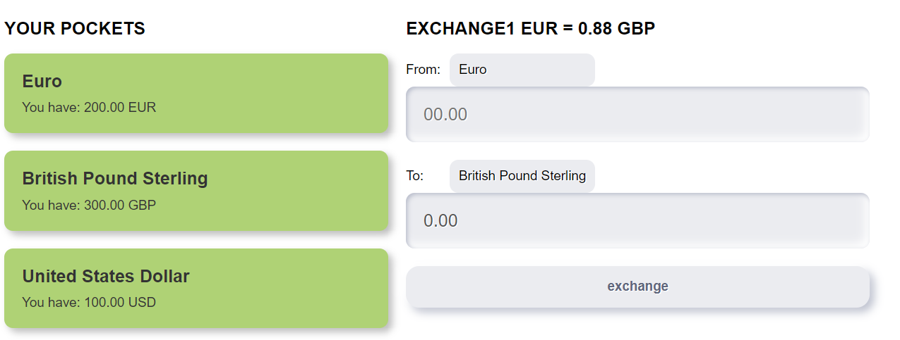

# Currency exchange

A currency exchange application. The application simulates transactions between bank accounts in different currencies with real-time exchange rates from the openexchangerates.org API.

## Requirements
- NodeJS
- Yarn or npm

## Technologies used
- TypeScript.
- React.
- React hooks.
- Redux.
- Typesafe actions.
- Reselect.
- Emotion for CSS in JS.
- Jest, Enzyme for unit tests.

## Installation
- Clone the project from the GitHub.
  ```git clone git@github.com:DmitriyNoa/currency-exchange.git```   
- Go to project directory.
  ```cd currency-exchange```
- Install the dependencies.
  ```yarn install```
- Rename .env_example to .env.
- Register on openexchangerates and add an API key to the .env in REACT_APP_API_KEY variable.

## Running
```yarn serve```

## Build
```yarn build```

## Production run
```yarn start```

## Notes and TODOs
- Add more unit tests.
- For the better scalability - move to feature/module based file structure: e.g. all actions, reducers, components related to a certain functionality should be under one folder or module. 
- Split the exchange component to smaller, atomic components.
- Create a CSS theme, move all CSS colors, font sizes, etc. to a theme for reuse across the app to avoid duplications.
- Add TSDOC comments.